# 获取指定协议的 TVL （Total Value Locked）
TVL（总锁仓量） 可以很好的反映一个协议支持代币的活跃程度，因此获取一个特定协议的总锁仓量对于一个钱包应用来说是至关重要的；

> 主要负责：AAVE2、AAVE3、Compound 这三种协议总锁仓量的计算

**要求**
1. 快速入门 javascript、web3.js 框架、hardhat 框架；
2. 掌握 ethereumScan 使用、学会提取智能合约 abi、区分抽象合约
3. 与后端配合，保证接口可用（写使用文档）
4. 每一种协议的所有代币的精度都必须保证正确，计算出的 TVL 值需要与官网的值进行比对（误差率不能超过 5%）

**Leader 给的学习路线**
- 学习 web3.js 框架
- 掌握交易解析
- 掌握 uniswap v1、v2 价格预言机计算
- 掌握 AMM 原理
- 掌握事件解析
- 掌握分析代币精度的算法（MKR、cETH 需要特殊处理）
- 掌握代币兑换 USDT 和 Ether 的兑换率

**难点**
- 精度准确获取问题（AAVE 没有提供获取精度的 API）

**解决思路**
1. 调用借贷池合约提供的 getReverseData(address) 方法获取该代币的 tuple 信息
2. 分析 tuple 包含的内容（configure、aTokenAddress）
3. 去 ethereumScan 查询 AAVE 合约中 configure 包含的内容（data，类型 uint256）
4. 从源码中分析 data 构成（如下所示）
5. 找到 DECIMALS_MASK 位掩码，发现精度信息位于低位第 7 个字节位置（共 32 字节，相当于高位起的第 26 个字节）
6. 将 data 转换为 16 进制表示，并在左侧填充 0 使数据长度为 32 字节，然后将 16 进制数据转换为字节形式
7. 获取第 26 个字节的值（字节数组下标为 25）得到精度信息
8. 验证所有 token 的精度信息是否正确（✅）


```jsx
uint256 internal constant LTV_MASK =                       0xFFFFFFFFFFFFFFFFFFFFFFFFFFFFFFFFFFFFFFFFFFFFFFFFFFFFFFFFFFFF0000;
uint256 internal constant LIQUIDATION_THRESHOLD_MASK =     0xFFFFFFFFFFFFFFFFFFFFFFFFFFFFFFFFFFFFFFFFFFFFFFFFFFFFFFFF0000FFFF;
uint256 internal constant LIQUIDATION_BONUS_MASK =         0xFFFFFFFFFFFFFFFFFFFFFFFFFFFFFFFFFFFFFFFFFFFFFFFFFFFF0000FFFFFFFF;
uint256 internal constant DECIMALS_MASK =                  0xFFFFFFFFFFFFFFFFFFFFFFFFFFFFFFFFFFFFFFFFFFFFFFFFFF00FFFFFFFFFFFF;
uint256 internal constant ACTIVE_MASK =                    0xFFFFFFFFFFFFFFFFFFFFFFFFFFFFFFFFFFFFFFFFFFFFFFFFFEFFFFFFFFFFFFFF;
uint256 internal constant FROZEN_MASK =                    0xFFFFFFFFFFFFFFFFFFFFFFFFFFFFFFFFFFFFFFFFFFFFFFFFFDFFFFFFFFFFFFFF;
uint256 internal constant BORROWING_MASK =                 0xFFFFFFFFFFFFFFFFFFFFFFFFFFFFFFFFFFFFFFFFFFFFFFFFFBFFFFFFFFFFFFFF;
uint256 internal constant STABLE_BORROWING_MASK =          0xFFFFFFFFFFFFFFFFFFFFFFFFFFFFFFFFFFFFFFFFFFFFFFFFF7FFFFFFFFFFFFFF;
uint256 internal constant PAUSED_MASK =                    0xFFFFFFFFFFFFFFFFFFFFFFFFFFFFFFFFFFFFFFFFFFFFFFFFEFFFFFFFFFFFFFFF;
uint256 internal constant BORROWABLE_IN_ISOLATION_MASK =   0xFFFFFFFFFFFFFFFFFFFFFFFFFFFFFFFFFFFFFFFFFFFFFFFFDFFFFFFFFFFFFFFF;
uint256 internal constant SILOED_BORROWING_MASK =          0xFFFFFFFFFFFFFFFFFFFFFFFFFFFFFFFFFFFFFFFFFFFFFFFFBFFFFFFFFFFFFFFF;
uint256 internal constant FLASHLOAN_ENABLED_MASK =         0xFFFFFFFFFFFFFFFFFFFFFFFFFFFFFFFFFFFFFFFFFFFFFFFF7FFFFFFFFFFFFFFF;
uint256 internal constant RESERVE_FACTOR_MASK =            0xFFFFFFFFFFFFFFFFFFFFFFFFFFFFFFFFFFFFFFFFFFFF0000FFFFFFFFFFFFFFFF;
uint256 internal constant BORROW_CAP_MASK =                0xFFFFFFFFFFFFFFFFFFFFFFFFFFFFFFFFFFF000000000FFFFFFFFFFFFFFFFFFFF;
uint256 internal constant SUPPLY_CAP_MASK =                0xFFFFFFFFFFFFFFFFFFFFFFFFFF000000000FFFFFFFFFFFFFFFFFFFFFFFFFFFFF;
uint256 internal constant LIQUIDATION_PROTOCOL_FEE_MASK =  0xFFFFFFFFFFFFFFFFFFFFFF0000FFFFFFFFFFFFFFFFFFFFFFFFFFFFFFFFFFFFFF;
uint256 internal constant EMODE_CATEGORY_MASK =            0xFFFFFFFFFFFFFFFFFFFF00FFFFFFFFFFFFFFFFFFFFFFFFFFFFFFFFFFFFFFFFFF;
uint256 internal constant UNBACKED_MINT_CAP_MASK =         0xFFFFFFFFFFF000000000FFFFFFFFFFFFFFFFFFFFFFFFFFFFFFFFFFFFFFFFFFFF;
uint256 internal constant DEBT_CEILING_MASK =              0xF0000000000FFFFFFFFFFFFFFFFFFFFFFFFFFFFFFFFFFFFFFFFFFFFFFFFFFFFF;
```
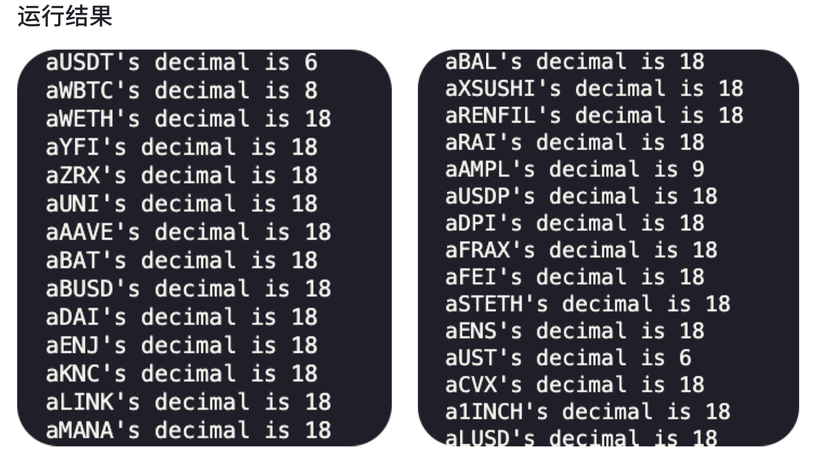

# TVL 计算结果及官网验证

## AAVE2

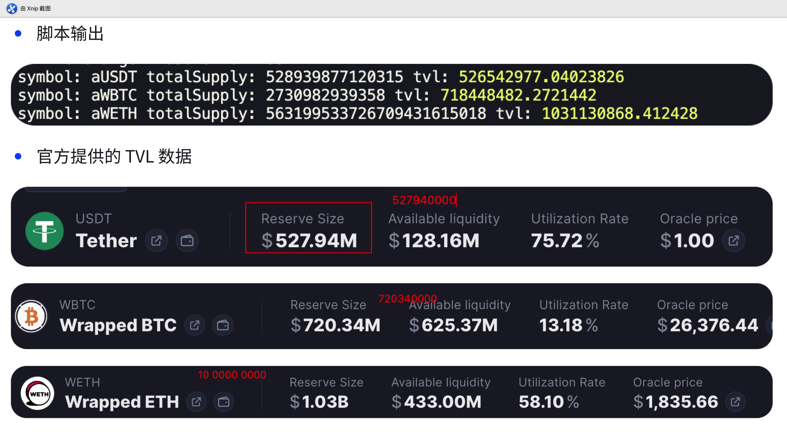

## AAVE3
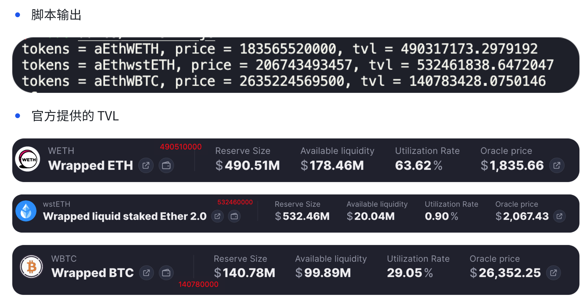

## Compound V2
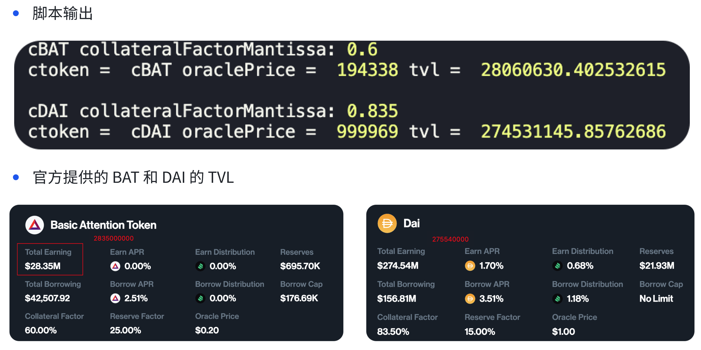

# 优化

## AAVE2
- 优化前
.png)

- 优化后
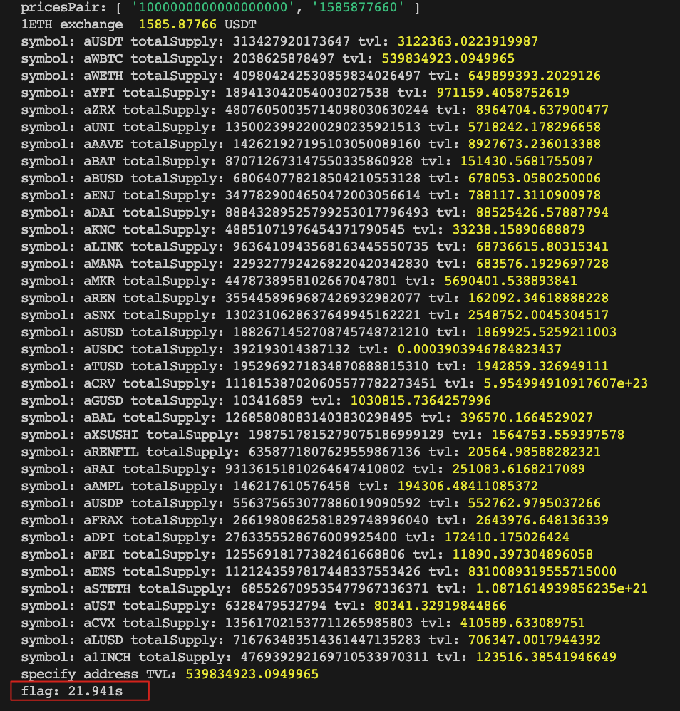

## AAVE3
- 优化前
<video src="images/iShot_2023-09-25_01.29.26.mp4" controls title="Title"></video>

- 优化后
<video src="images/iShot_2023-09-25_01.31.12.mp4" controls title="Title"></video>


## Compound V2
- 优化前查询时间

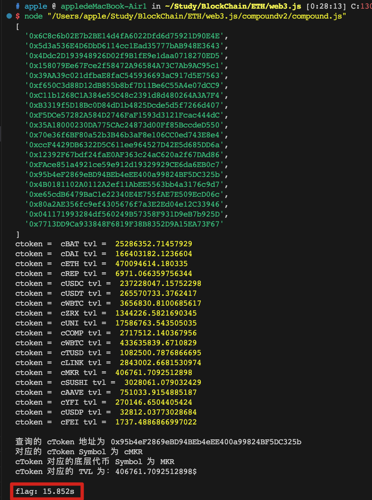
- 优化后查询时间（使用并发）

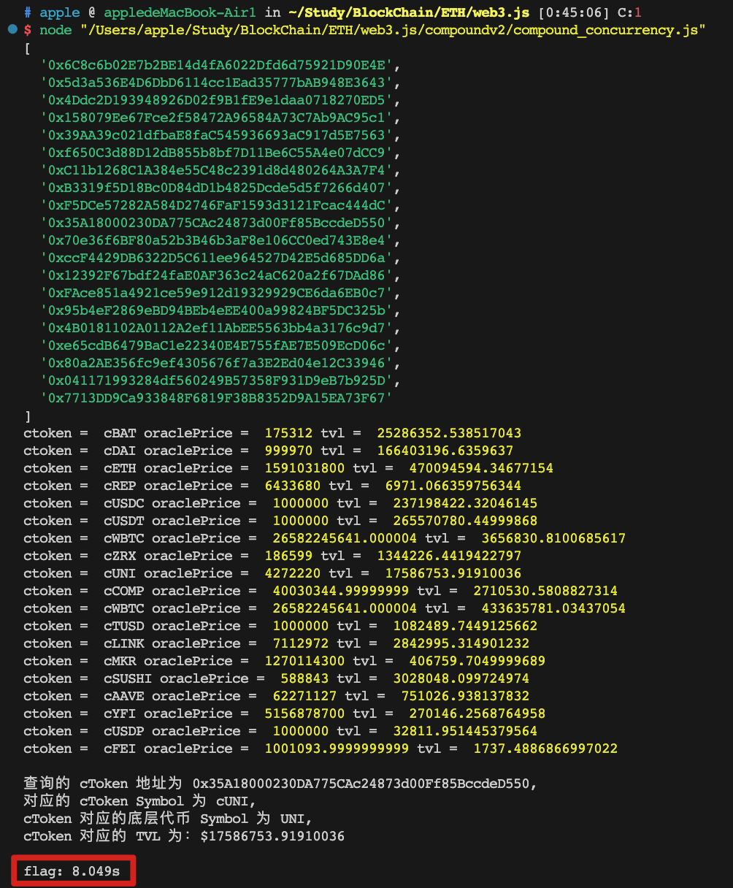

# 基础构建块
## 解析交易收据
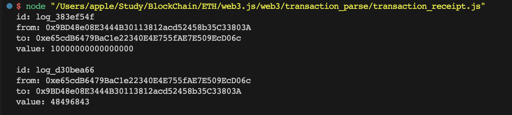
代码位置：`web3JS_FrameWork_Study/5_web3_transaction_parse/transaction_receipt.js`

## 获取所有代币价格（相对于以太币）
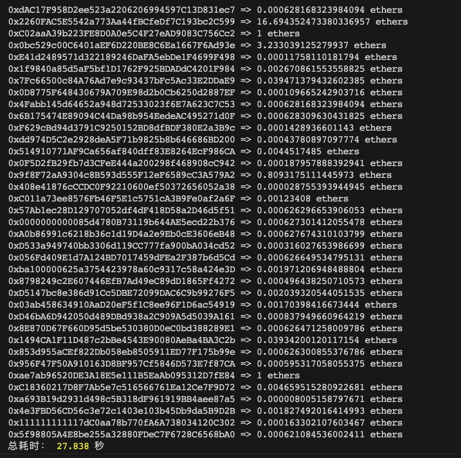
代码位置（非缓存）：`getTokensPrices/getAllTokensPricesWithoutStore.js`
代码位置（缓存）：`getTokensPrices/getAllTokensPricesWithStore.js`

## 获取所有代币价格（并发版本）
<video src="/images/iShot_2023-09-24_21.33.15.mp4" controls title="Title"></video>
代码位置（并发）：`getTokensPrices/getAllTokensPricesConcurrency.js`

## 代币兑换（⭐️⭐️⭐️⭐️⭐️）
两个核心方法
### getAmountsOut
存入 1 DAI，计算可以撤出的 USDT 的数量；
```jsx
priceContractInstance.methods.getAmountsOut("1000000000000000000", ['0x6B175474E89094C44Da98b954EedeAC495271d0F','0xA0b86991c6218b36c1d19D4a2e9Eb0cE3606eB48']).call()
```
DAI 为存入的代币，所以调用形式为：
```jsx
getAmountsOut("1000000000000000000", ['DAI_ADDRESS', 'USDT_ADDRESS'])
```
### getAmountsIn

取出 997651 USDT，计算需要往池中存入的 DAI 的数量
```jsx
priceContractInstance.methods.getAmountsIn("997651000000", ['0x6B175474E89094C44Da98b954EedeAC495271d0F','0xA0b86991c6218b36c1d19D4a2e9Eb0cE3606eB48']).call()
```
DAI 为存入代币，USDT 为撤出代币，所以调用形式：
```jsx
getAmountsIn("997651", ['DAI_ADDRESS','USDT_ADDRESS'])
```
代码位置：`token_exchange/exchange.js`

## 订阅监听特定事件
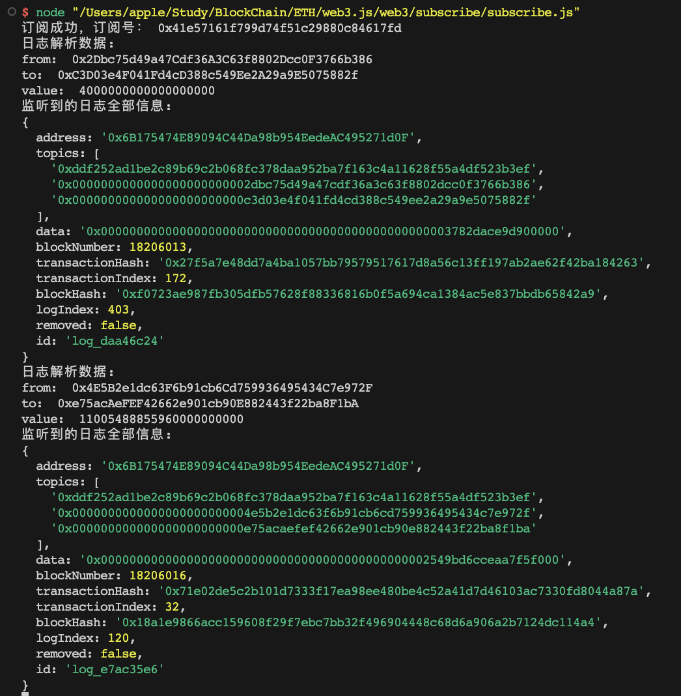
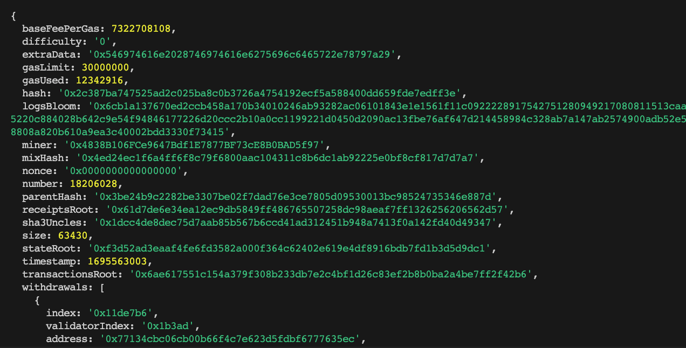
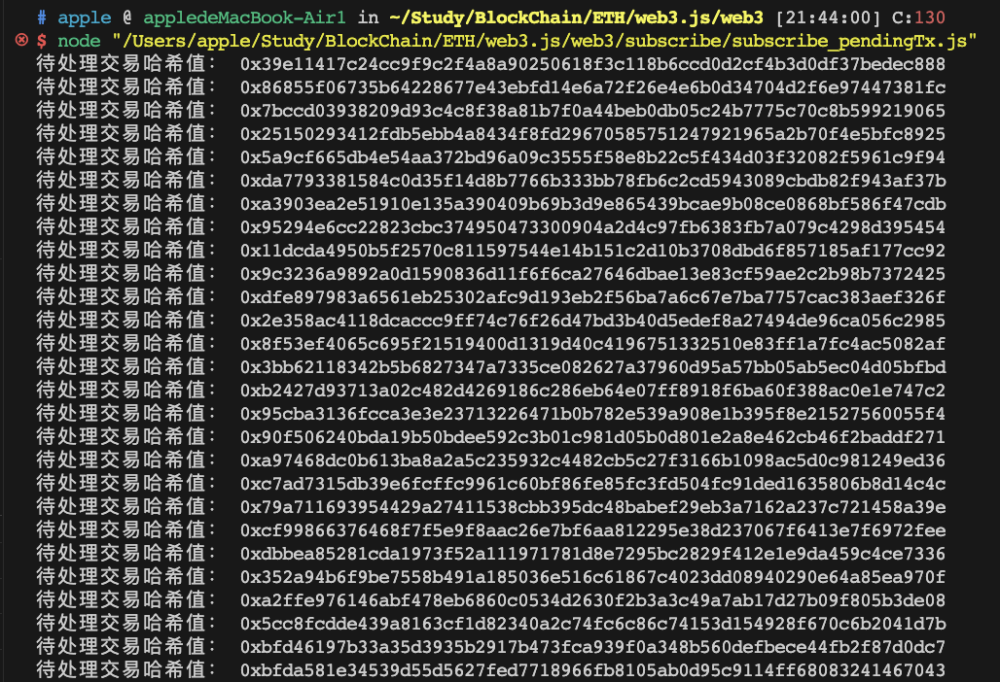
代码位置：`web3JS_FrameWork_Study/4_web3_subscribe`

## 监听所有事件并进行过滤
如图所示，我们要监听 Transfer 事件，它的事件签名值已经被打印出来了，观察之后监听日志输出是否全部都是该签名值的事件。
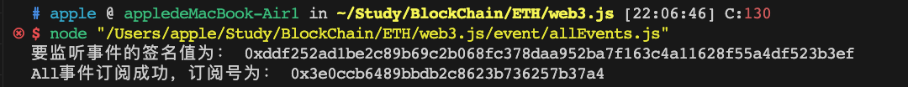
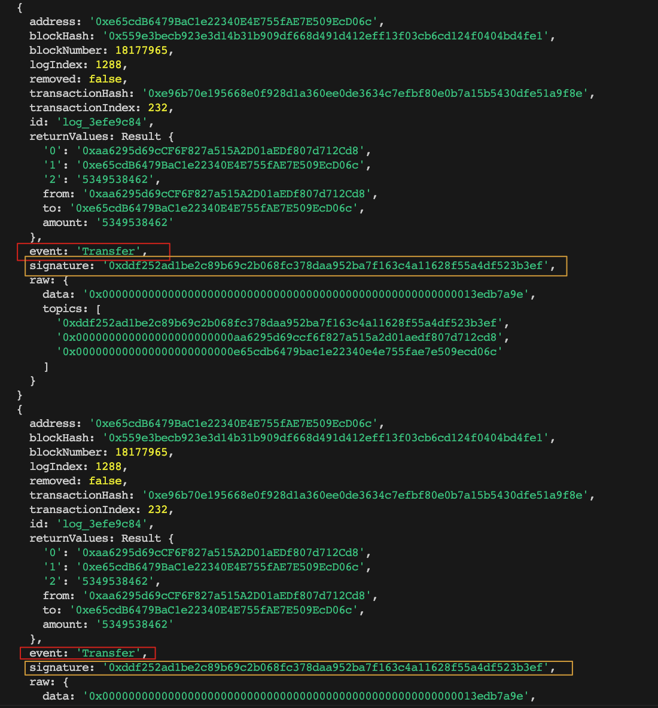
如果想要监听其他时间，只需要修改事件方法签名重新计算一个签名值即可；
代码位置：`web3JS_FrameWork_Study/6_web3_event/All_Event.js`


## Transfer 事件过滤后解析
设置过滤器，对监听的事件进行过滤
1. from：限定交易发起者
2. to：限定交易接收者
3. fromBlock: 起始区块

对过滤出的事件进行解析，拿到关键数据
- from
- to
- value

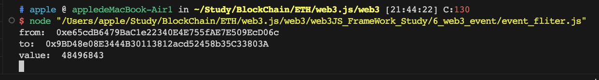
代码位置：`web3JS_FrameWork_Study/6_web3_event/Event_Fliter_Parse.js`

## 对历史事件进行解析

假设我们想要查询过去某段时间（某个区块区间）内的 Transfer 事件，那么我们需要先拿到某段时间内的区块号，然后根据区块号去查询某段时间内的 Transfer 事件，最后对 Transfer 事件进行解析。

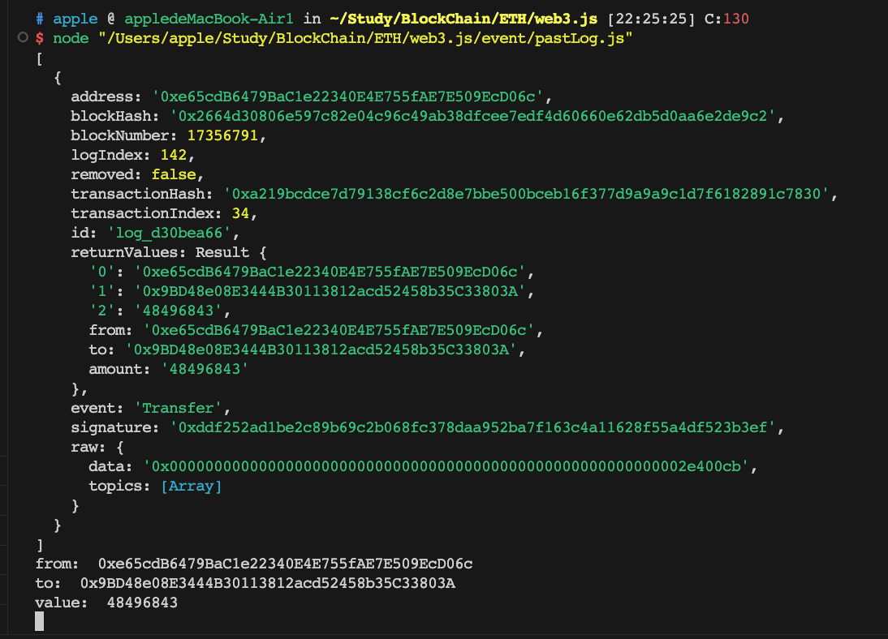

## 小结
现在我们已经可以
- 解析交易收据
- 订阅事件、过滤事件、解析事件并拿到关键数据
- 币币兑换（⭐️⭐️⭐️⭐️⭐️）
- 获取协议支持的所有代币列表和它们的价格（⭐️⭐️⭐️⭐️⭐️）
- 获取储备数据信息（⭐️⭐️⭐️⭐️⭐️）
- 获取精度（⭐️⭐️⭐️⭐️⭐️）


